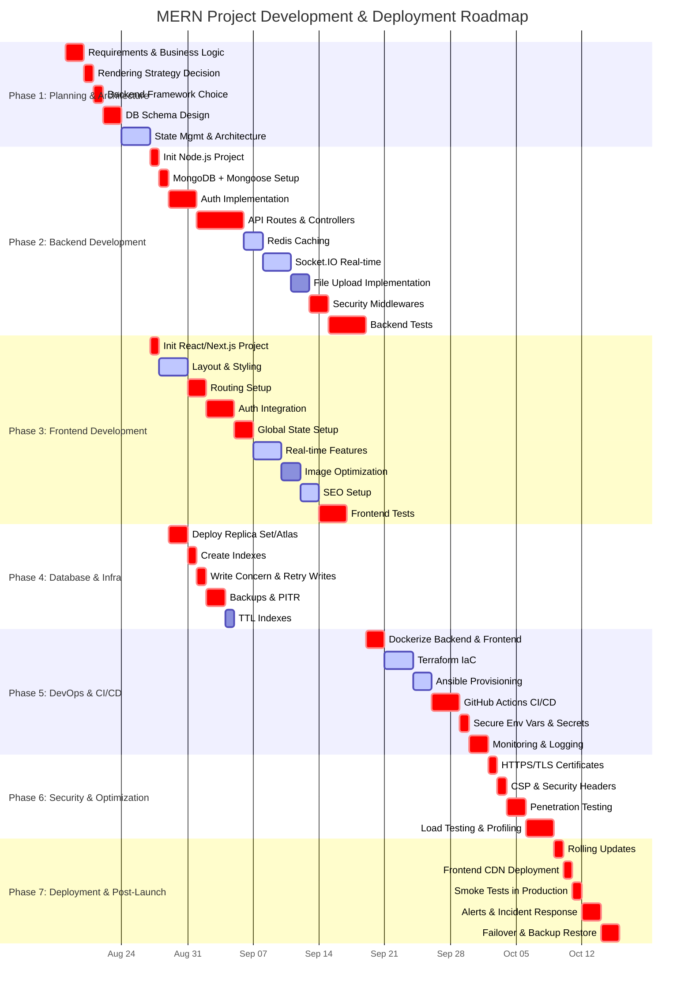
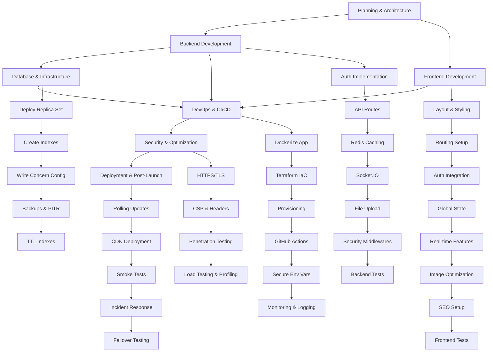

1. **TODO List** (detailed checklist from Planning → Deployment).
2. **Gantt Chart** (with priorities).
3. **Dependency Flowchart** (showing task dependencies).

This will be **one master doc** so you can drop it into GitHub, Notion, or a project wiki and have **all planning, scheduling, and dependencies in one place**.

***

## 📋 **MERN Development \& Deployment Master Plan**

### **1️⃣ Detailed TODO List**

*(from Planning → Deployment → Maintenance)*

#### **Phase 1 – Planning \& Architecture**

- [ ] Define project requirements \& business logic **(High)**
- [ ] Choose rendering strategy (CSR/SSR/SSG) **(High)**
- [ ] Pick backend framework (Express/Fastify/NestJS) **(High)**
- [ ] Design database schema (embedded vs referenced) **(High)**
- [ ] Decide state management (Redux/Zustand/Context) **(Medium)**
- [ ] Create component architecture (layout → widgets → utilities) **(Medium)**
- [ ] Define security \& authentication requirements **(High)**

#### **Phase 2 – Backend Development**

- [ ] Init Node.js project structure **(High)**
- [ ] MongoDB + Mongoose setup **(High)**
- [ ] Implement authentication (JWT/OAuth) **(High)**
- [ ] Create API routes \& controllers **(High)**
- [ ] Add Redis caching **(Medium)**
- [ ] Implement Socket.IO for real-time features **(Medium)**
- [ ] File uploads with Multer + CDN **(Low)**
- [ ] Security middlewares (Helmet, CORS, rate-limit) **(High)**
- [ ] Backend unit/integration tests **(High)**

#### **Phase 3 – Frontend Development**

- [ ] Init React/Next.js project **(High)**
- [ ] Layout \& styling **(Medium)**
- [ ] Routing setup **(High)**
- [ ] Auth integration with backend **(High)**
- [ ] Global state setup **(High)**
- [ ] Real-time features with Socket.IO client **(Medium)**
- [ ] Image \& asset optimization **(Low)**
- [ ] SEO setup (Helmet / head tags) **(Medium)**
- [ ] Frontend tests **(High)**

#### **Phase 4 – Database \& Infrastructure**

- [ ] Deploy replica set / Atlas cluster **(High)**
- [ ] Create indexes for performance **(High)**
- [ ] Configure write concern \& retryable writes **(High)**
- [ ] Enable backups \& point-in-time recovery **(High)**
- [ ] Create TTL indexes (cleanup tasks) **(Low)**

#### **Phase 5 – DevOps \& CI/CD**

- [ ] Dockerize backend \& frontend **(High)**
- [ ] Terraform IaC provisioning **(Medium)**
- [ ] Ansible server configuration **(Medium)**
- [ ] GitHub Actions CI/CD pipeline **(High)**
- [ ] Secure environment variables \& secrets **(High)**
- [ ] Setup monitoring \& logging **(High)**

#### **Phase 6 – Security \& Optimization**

- [ ] HTTPS/TLS certificates **(High)**
- [ ] CSP headers \& security best practices **(High)**
- [ ] Penetration testing **(High)**
- [ ] Load testing \& profiling **(High)**

#### **Phase 7 – Deployment \& Post-Launch**

- [ ] Rolling updates for backend **(High)**
- [ ] Frontend deployment via CDN **(High)**
- [ ] Smoke tests in production **(High)**
- [ ] Alerts \& incident response setup **(High)**
- [ ] Failover \& backup restore testing **(High)**

***

### **2️⃣ Gantt Chart – Timeline \& Priorities** https://www.mermaidchart.com/app/projects/efe86ce1-4dfc-4f10-8306-41bb73775306/diagrams/1c164a62-958d-409c-bd31-31d5ed34e272/version/v0.1/edit

***

### **3️⃣ Dependency Flowchart – Structure View** https://www.mermaidchart.com/app/projects/efe86ce1-4dfc-4f10-8306-41bb73775306/diagrams/ecac7df4-9ab2-44fc-9263-d15d848cf4d2/version/v0.1/edit

***

✅ Now you have **all 3 layers integrated**:

- **Detailed actionable checklist** (for execution).
- **Timeline Gantt chart** (for scheduling \& tracking).
- **Dependency flowchart** (for visualizing blockers \& parallel work).

***

